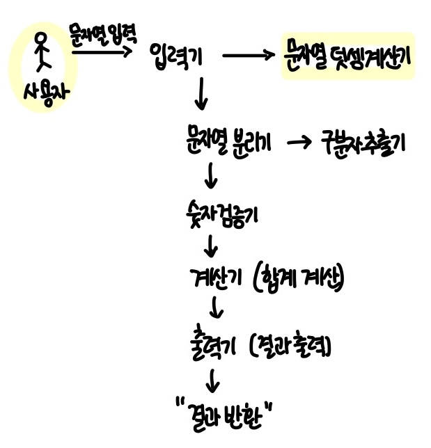
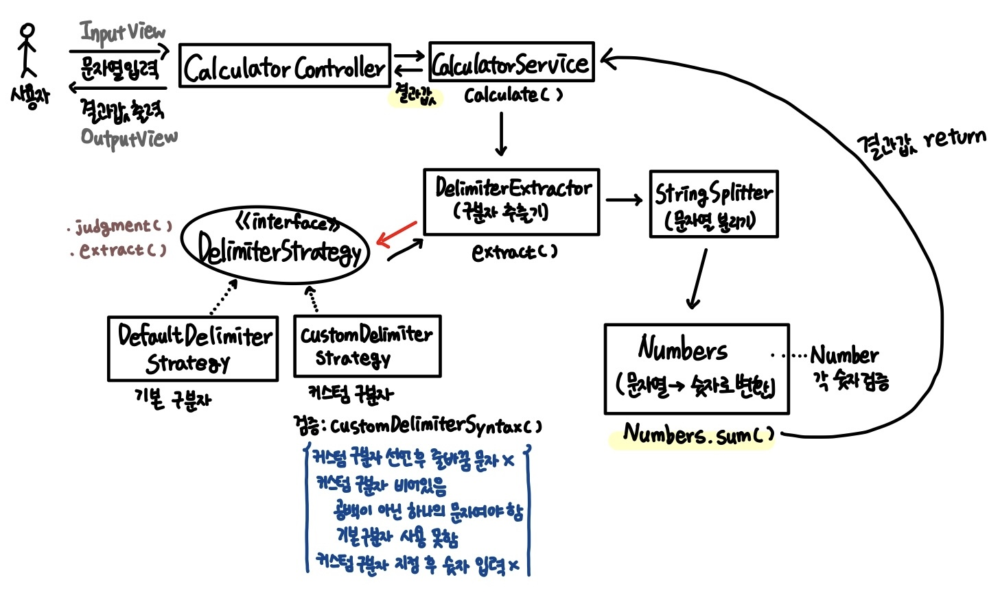

# 문자열 덧셈 계산기 🧮

문자열을 입력받아, 구분자를 기준으로 숫자를 분리하고 합계를 계산해 결과를 출력한다.

---

이 시스템에서 핵심 기능💡은 "문자열에서 숫자를 추출하는 기능"이다.  
따라서 **입력 문자열을 받아서 숫자 리스트로 변환하기**가 우선적으로 구현되어야한다.

- 구분자 판단 로직 (`DelimiterExtractor`)
    - 문자열이 //로 시작하는지 판단
        - //와 \n 사이의 문자를 커스텀 구분자로 추출
    - 그렇지 않으면 기본 구분자(쉼표, 콜론) 사용
- 문자열 분리 로직 (`StringSplitter`)
    - 구분자를 기준으로 숫자 부분 문자열을 분리

---

## 기능 명세서

### 1. 문자열을 입력받는다

- [입력기] "덧셈할 문자열을 입력해 주세요." 문구를 출력한다
- [입력기] 사용자의 입력을 문자열로 전달받는다
- [문자열덧셈계산기] 입력값을 전달받아 전체 계산 흐름을 시작한다

**예외상황**

- [입력기] 입력값이 `null`인 경우

### 2. 입력값이 비어있으면 0을 반환한다

- [문자열덧셈계산기] 입력 문자열이 빈 문자열(`""`)인지 확인한다
- [문자열덧셈계산기] 비어있다면 0을 [출력기]에 전달하여 출력한다

### 3. 입력 문자열에서 구분자를 추출한다

- [문자열분리기] 입력 문자열을 전달받는다
- [구분자추출기] 입력 문자열이 "//"로 시작하는지 확인한다
- [구분자추출기] "//"와 "\n" 사이의 문자를 커스텀 구분자로 추출한다
- [구분자추출기] 커스텀 구분자가 없으면 기본 구분자(쉼표, 콜론)를 반환한다
- [구분자추출기] 구분자와 숫자 부분 문자열을 분리하여 반환한다

**예외상황**

- [구분자추출기] //로 시작했지만 \n이 존재하지 않은 경우
- [구분자추출기] //, \n 사이에 위치하는 문자가 작성되지 않은 경우
- [구분자추출기] 구분자 지정 후 본문이 비어있는 경우

### 4. 구분자를 기준으로 문자열을 분리한다

- [문자열분리기] 전달받은 구분자를 기준으로 숫자 부분 문자열을 분리한다
- [문자열분리기] 분리된 문자열 목록을 [숫자검증기]에 전달한다

### 5. 분리된 문자열을 숫자로 변환하고 **유효성을 검증**한다

- [숫자검증기] 각 문자열이 숫자인지 확인한다
- [숫자검증기] 정수로 변환한다
- [숫자검증기] 숫자가 음수인지 확인한다
- [숫자검증기] 모든 숫자가 유효하면 숫자 리스트를 반환한다

**예외상황**

- [숫자검증기] 숫자가 아닌 문자가 포함된 경우 ("1,a,3")
- [숫자검증기] 음수가 포함된 경우 ("-1,2")

### 6. 숫자들의 합을 계산한다

- [계산기] 숫자 리스트를 전달받는다
- [계산기] 모든 숫자의 합을 계산한다
- [계산기] 계산된 결과를 [문자열덧셈계산기]로 반환한다

### 7. 계산 결과를 출력한다

- [문자열덧셈계산기] 계산 결과를 [출력기]에 전달한다
- [출력기] `결과 : {합계}` 형식으로 결과를 출력한다

> 예외 상황에는 `IllegalArgumentException`을 발생시킨 후 애플리케이션은 종료되어야 한다.

---

### 기능 요구 사항에 기재되지 않은 내용에서 스스로 판단한 부분

- 커스텀 구분자는 1글자만 허용한다
    - 예시) `"//"\n1"2"3` : 허용 O
    - 예시) `"//;"\n1;2"3` : 허용 X

---

### (최종) 문자열 덧셈 계산기 전체 흐름

**전체 흐름**

1. 사용자가 문자열을 입력한다
2. `CalculatorController`가 입력을 받아 `CalculatorService`에게 계산을 요청한다
3. `CalculatorService`는 다음 순서로 계산 과정을 진행한다.  
   3-1. `DelimiterExtractor`에게 구분자를 추출시킨다.  
   3-2. 추출된 구분자로 `StringSplitter`가 (숫자 부분의) 문자열을 분리한다.  
   3-3. 분리된 (숫자 부분의) 문자열 목록을 `Numbers`에 전달해 숫자로 변환하고 유효성을 검증한다.  
   3-4. 검증된 숫자들을 더해 `sum()` 결과를 계산한다.
4. 계산된 결과값을 `CalculatorController`가 전달받아 `OutputView`를 통해 사용자에게 결과를 출력한다.
